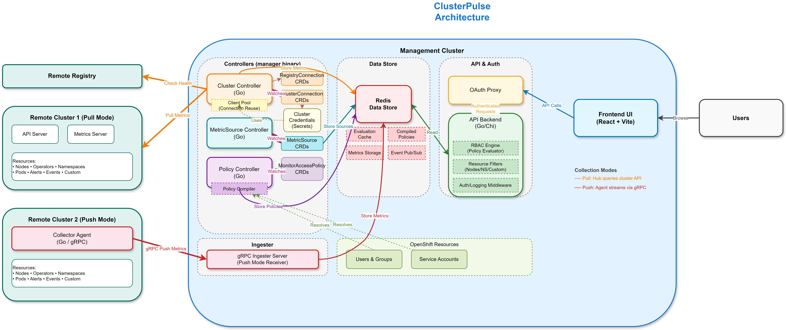

# ClusterPulse

Multi-cluster Kubernetes/OpenShift monitoring with policy-based RBAC. ClusterPulse collects health, capacity, operator, and arbitrary custom-resource data from a fleet of clusters, stores it centrally, and serves a filtered view of that data to each user based on `MonitorAccessPolicy` CRDs.

Full documentation: <https://clusterpulse.github.io/clusterpulse/latest/>

## What it does

- Connects to remote clusters via a `ClusterConnection` CRD. Either the hub pulls metrics over the cluster's API (default), or a collector agent on the managed cluster pushes metrics back over gRPC.
- Collects node, namespace, pod, deployment, operator, and OpenShift `ClusterOperator` state. Optional `MetricSource` CRDs collect any other Kubernetes resource via JSONPath field extraction with cluster-wide aggregations.
- Optionally monitors container registries (Docker v2 API) via `RegistryConnection`.
- Compiles `MonitorAccessPolicy` CRDs into Redis-indexed structures so the API can authorize every request without hitting the kube-apiserver.
- Filters every response — clusters, nodes, namespaces, operators, custom resources, and aggregations — to what the requesting principal is allowed to see.
- Authenticates via OAuth proxy headers (`X-Forwarded-User` / `X-Forwarded-Email`), resolving group membership from OpenShift `User`/`Group` CRs.

## Components

| Binary | Path | Purpose |
|---|---|---|
| `manager` | `cmd/manager/` | Controller manager. Reconciles `ClusterConnection`, `MonitorAccessPolicy`, `MetricSource`, `RegistryConnection`. Embeds the gRPC ingester for push-mode collectors. |
| `api` | `cmd/api/` | Chi-based REST server. Serves `/api/v1/*` to the UI with RBAC applied per request. |
| `collector` | `cmd/collector/` | Per-cluster agent for push mode. Streams metrics to the hub ingester. |

The frontend is in a separate repo (React/TypeScript/PatternFly).

## Architecture



See [docs/concepts/architecture.md](docs/concepts/architecture.md) for the full description.

## Deployment

The Helm chart and operator manifests live in [`ClusterPulse/operator`](https://github.com/ClusterPulse/operator).

### OperatorHub (OpenShift)

ClusterPulse is in the community operator index. Install from **Operators → OperatorHub** in the OpenShift console, then create a `ClusterPulse` CR. Full walkthrough in [docs/getting-started/installation.md](docs/getting-started/installation.md).

### Helm

```bash
git clone https://github.com/ClusterPulse/operator.git
cd operator/
make install                                              # Installs CRDs
helm install clusterpulse ./helm-charts/clusterpulse      # Installs ClusterPulse
```

## Documentation

- [Getting started](https://clusterpulse.github.io/clusterpulse/latest/getting-started/) — install + first cluster + first policy
- [How-to guides](https://clusterpulse.github.io/clusterpulse/latest/how-to/) — connecting clusters/registries, writing policies, defining MetricSources, push mode, ingester TLS
- [Concepts](https://clusterpulse.github.io/clusterpulse/latest/concepts/) — architecture, RBAC model, policy evaluation
- [Contributing](docs/contributing/) — per-component developer guides

## Tech stack

- Go (controller-runtime for reconcilers, Chi for the API, gRPC for collector/ingester)
- Redis (current state + policy indexes)
- VictoriaMetrics (optional, time-series history)
- Kubernetes / OpenShift

## License

Apache 2.0 — see [LICENSE](LICENSE).

## Support

- [GitHub Issues](https://github.com/ClusterPulse/clusterpulse/issues)
