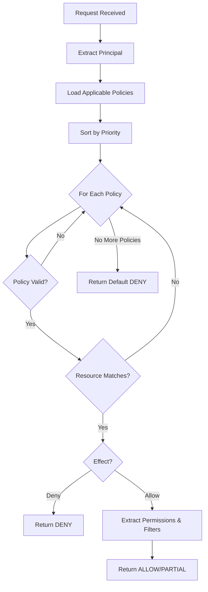
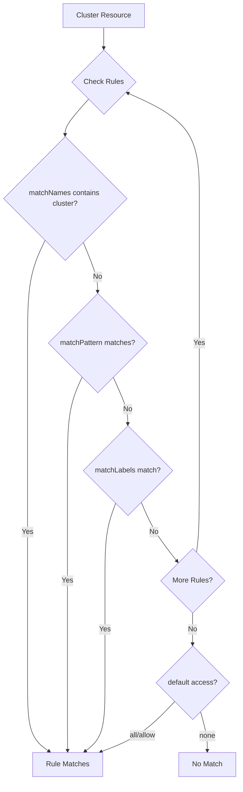
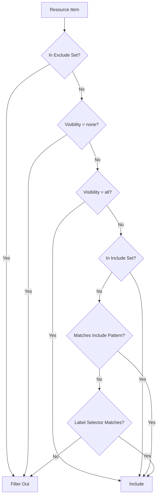
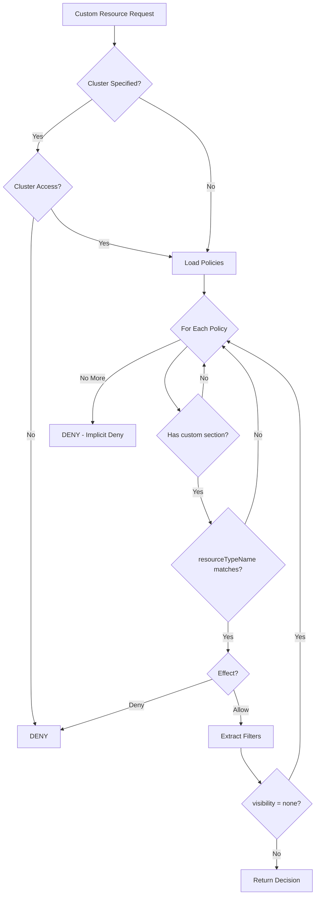
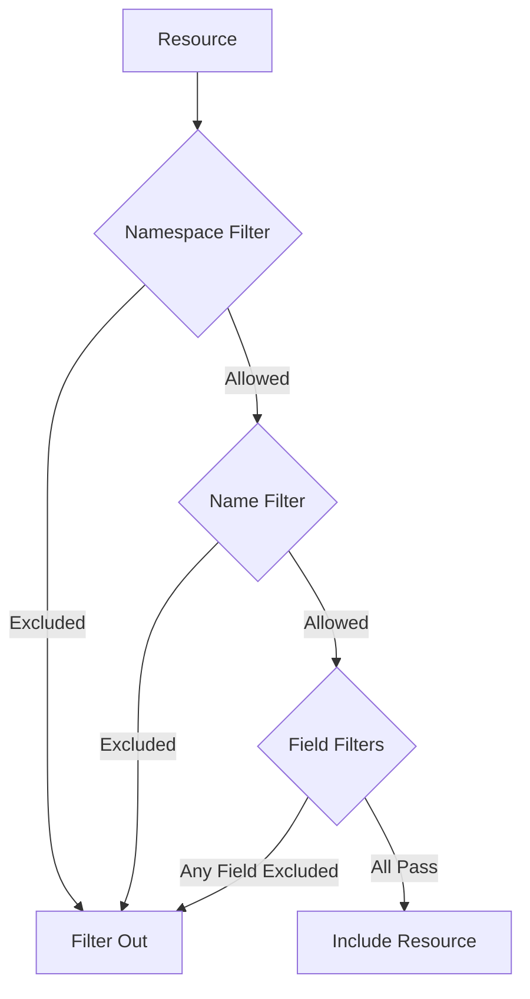
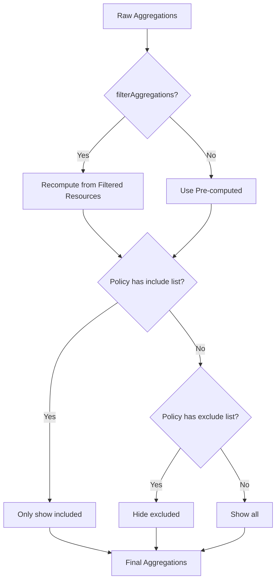
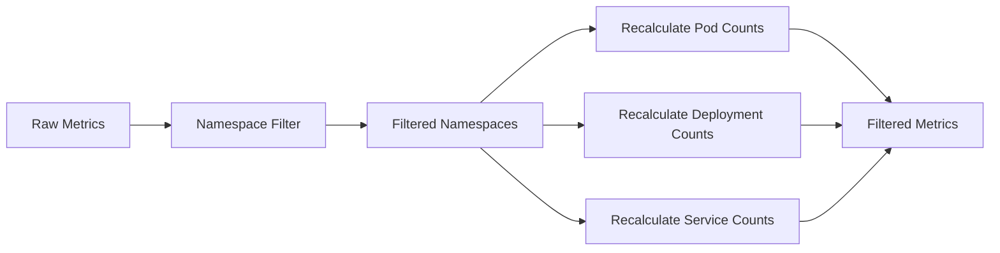

# Policy Evaluation

This document describes how ClusterPulse evaluates policies to make authorization decisions.

## Evaluation Flow



## Step 1: Policy Retrieval

When a request arrives, the RBAC engine retrieves all policies that might apply to the principal.

### Index Lookup

Policies are retrieved from Redis using multiple indexes:

```python
# Pseudocode
policy_keys = set()

# User-specific policies
policy_keys.update(redis.zrevrange(f"policy:user:{username}:sorted"))

# Group policies (for each group)
for group in principal.groups:
    policy_keys.update(redis.zrevrange(f"policy:group:{group}:sorted"))

# Service account policies (if applicable)
if principal.is_service_account:
    policy_keys.update(redis.zrevrange(f"policy:sa:{sa_name}:sorted"))
```

### Priority Sorting

Retrieved policies are sorted by priority in descending order (highest priority first, meaning lowest numeric value):

| Priority | Order |
|----------|-------|
| 0 | First (highest priority) |
| 100 | Second |
| 200 | Third |
| 999 | Last (lowest priority) |

## Step 2: Policy Validation

Each policy is validated before evaluation:

### Enabled Check

```python
if not policy.enabled:
    skip_policy()
```

### Time-Based Validity

```python
now = datetime.utcnow()

if policy.not_before and now < policy.not_before:
    skip_policy()  # Policy not yet active

if policy.not_after and now > policy.not_after:
    skip_policy()  # Policy expired
```

## Step 3: Resource Matching

The engine determines if the policy applies to the requested resource.

### Cluster Matching

For cluster resources, rules are matched using selectors:



#### Selector Types

| Selector | Description |
|----------|-------------|
| `matchNames` | Exact cluster name match |
| `matchPattern` | Regex pattern match |
| `matchLabels` | Kubernetes label selector |

Example:

```yaml
rules:
  - selector:
      matchNames:
        - production-cluster
      matchLabels:
        environment: production
        region: us-west
```

### Sub-Resource Matching

For nodes, namespaces, operators, and pods, the engine evaluates resource filters after the cluster match.

## Step 4: Decision Generation

Once a matching policy is found, the engine generates a decision.

### Deny Effect

If the policy effect is `Deny`, evaluation stops immediately:

```python
if policy.effect == "Deny":
    return Decision(
        decision=DENY,
        reason=f"Denied by policy {policy.name}"
    )
```

### Allow Effect

For `Allow` policies, permissions and filters are extracted:

```python
if policy.effect == "Allow":
    permissions = extract_permissions(rule)
    filters = extract_filters(rule)
    
    if filters:
        return Decision(
            decision=PARTIAL,
            permissions=permissions,
            filters=filters
        )
    else:
        return Decision(
            decision=ALLOW,
            permissions=permissions
        )
```

## Step 5: Filter Application

When a `PARTIAL` decision is returned, filters are applied to resource lists.

### Filter Evaluation Order



### Filter Precedence

1. **Exclude literals** - Highest priority, always filtered out
2. **Exclude patterns** - Filtered if pattern matches
3. **Include literals** - Included if in set
4. **Include patterns** - Included if pattern matches
5. **Label selectors** - Included if labels match
6. **Default** - Filtered out if visibility is `filtered`

## Custom Resource Evaluation

Custom resources defined by MetricSource CRDs follow a specialized evaluation path.

### Custom Resource Authorization Flow



### Implicit Deny for Custom Resources

Custom resource types not explicitly granted in a policy are denied by default. This implements a secure implicit deny model:

```python
# Only types explicitly in policy.custom_resources are accessible
accessible_types = set()
for policy in policies:
    for rule in policy.cluster_rules:
        for type_name, config in rule.custom_resources.items():
            if config.visibility != "none":
                accessible_types.add(type_name)
```

### Custom Resource Filter Evaluation

Custom resources are filtered through three stages:



#### Namespace Filtering

Applied to the field identified by `rbac.identifiers.namespace` in MetricSource:

```python
namespace = resource.get("_namespace")

# Check exclusions first
if namespace in filter.namespace_exclude_literals:
    return False
for pattern in filter.namespace_exclude_patterns:
    if pattern.match(namespace):
        return False

# Check inclusions
if filter.namespace_literals or filter.namespace_patterns:
    if namespace not in filter.namespace_literals:
        if not any(p.match(namespace) for p in filter.namespace_patterns):
            return False

return True
```

#### Name Filtering

Applied to the field identified by `rbac.identifiers.name` in MetricSource:

```python
name = resource.get("_name")
# Same logic as namespace filtering
```

#### Field Filtering

Applied to fields listed in `rbac.filterableFields`:

```python
for field_name, (allowed_lits, allowed_pats, denied_lits, denied_pats) in filters.items():
    value = resource.values.get(field_name)
    
    # Check exclusions
    if value in denied_lits:
        return False
    for pattern in denied_pats:
        if pattern.match(str(value)):
            return False
    
    # Check inclusions if specified
    if allowed_lits or allowed_pats:
        if value not in allowed_lits:
            if not any(p.match(str(value)) for p in allowed_pats):
                return False

return True
```

### Aggregation Filtering

Aggregations computed by the collector can be filtered at two levels:

1. **Recomputation**: When `filterAggregations: true` (default), aggregations are recomputed from the user's filtered resource set
2. **Visibility**: Policies can restrict which aggregation names are visible



Example policy aggregation rules:

```yaml
custom:
  pvc:
    aggregations:
      include:
        - totalStorage
        - countByPhase
      # Only these two aggregations visible
```

## Namespace Filtering Impact

When namespace filters are applied, metrics are recalculated:



Affected metrics:

| Metric | Calculation |
|--------|-------------|
| `namespaces` | Count of visible namespaces |
| `pods` | Sum of pods in visible namespaces |
| `pods_running` | Running pods in visible namespaces |
| `deployments` | Deployments in visible namespaces |
| `services` | Services in visible namespaces |
| `statefulsets` | StatefulSets in visible namespaces |
| `daemonsets` | DaemonSets in visible namespaces |

## Node Filtering Impact

Node filters affect capacity metrics:

| Metric | Calculation |
|--------|-------------|
| `nodes` | Count of visible nodes |
| `nodes_ready` | Ready nodes that are visible |
| `cpu_capacity` | Sum of CPU from visible nodes |
| `memory_capacity` | Sum of memory from visible nodes |
| `cpu_usage_percent` | Recalculated from visible nodes |
| `memory_usage_percent` | Recalculated from visible nodes |

## Multiple Policy Handling

When multiple policies apply to a principal:

### Same Priority

If policies have the same priority, evaluation order is undefined. Avoid this by assigning unique priorities.

### Deny Precedence

A `Deny` policy at any priority level stops evaluation:

```
Priority 100: Allow (skipped - Deny found first)
Priority 50: Deny  <-- Evaluation stops here
Priority 10: Allow (never reached)
```

### Additive Permissions

Permissions from a matching `Allow` policy are not additive. Only the first matching policy's permissions apply:

```
Priority 100: Allow {view: true}           <-- This applies
Priority 200: Allow {view: true, edit: true} (not reached)
```

## Caching Behavior

### Decision Cache

When caching is enabled, decisions are cached with the key:

```
rbac:decision:{principal_cache_key}:{action}:{resource_id}
```

For custom resources:

```
rbac:custom:{principal_cache_key}:{resource_type_name}:{cluster}:{action}
```

The `principal_cache_key` includes username and sorted groups:

```python
cache_key = f"{username}:{','.join(sorted(groups))}"
```

### Cache Invalidation

Caches are invalidated when:

1. **Policy created/updated/deleted** - All affected users, groups, and service accounts have their caches cleared
2. **Manual clear** - Via `POST /api/v1/auth/cache/clear`

Invalidation uses Redis SCAN to find affected keys:

```python
patterns = [
    f"policy:eval:{user}:*",
    f"policy:eval:*:group:{group}:*",
    f"policy:eval:{service_account}:*",
    f"rbac:custom:{user}:*"  # Custom resource cache
]
```

## Performance Considerations

### Optimization Strategies

1. **Redis Pipelining** - Batch multiple Redis operations
2. **Pattern Pre-compilation** - Wildcard patterns compiled to regex once
3. **Literal Indexing** - Exact matches use O(1) set lookups
4. **Priority Sorting** - Early termination on first match
5. **Custom Type Indexing** - Policies indexed by resource type for fast lookup

### Complexity Analysis

| Operation | Complexity |
|-----------|------------|
| Policy lookup | O(g) where g = number of groups |
| Priority sort | O(p log p) where p = policies |
| Filter evaluation | O(r * f) where r = resources, f = filter rules |
| Custom resource filter | O(r * (n + m + k)) where n = namespace filters, m = name filters, k = field filters |

## Debugging Evaluation

### View Applicable Policies

```bash
curl https://clusterpulse.example.com/api/v1/auth/policies
```

### Check Effective Permissions

```bash
curl https://clusterpulse.example.com/api/v1/auth/permissions
```

### List Accessible Custom Types

```bash
curl https://clusterpulse.example.com/api/v1/custom-types
```

### Enable Debug Logging

Set environment variable on the API:

```yaml
env:
  - name: LOG_LEVEL
    value: DEBUG
```

Debug logs show:

- Policy retrieval and sorting
- Validation results
- Match decisions
- Filter application
- Custom resource filter evaluation

## Related Documentation

- [RBAC Model](rbac-model.md) - Core concepts and data structures
- [Filter by Namespace](../how-to/policies/filter-by-namespace.md) - Practical filtering examples
