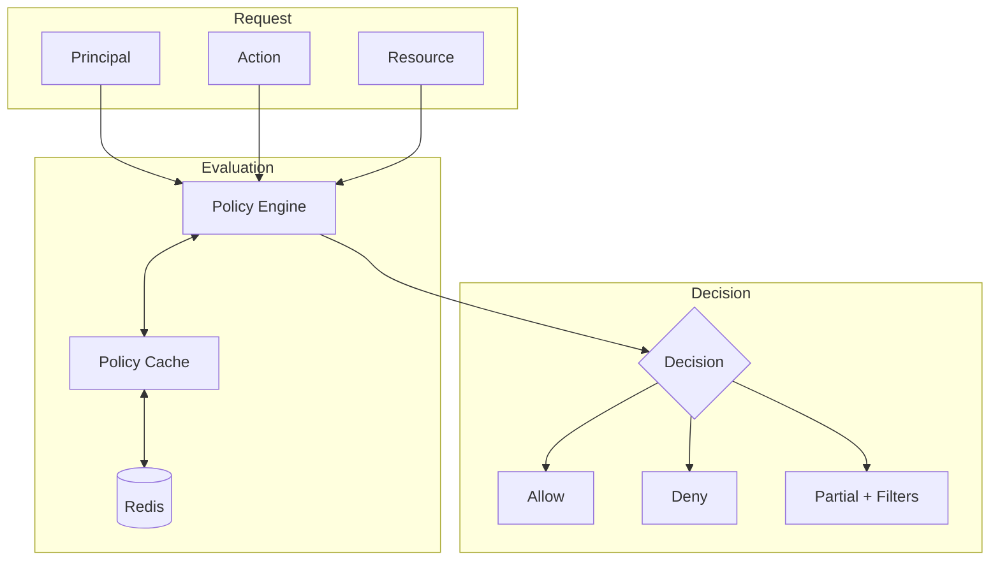
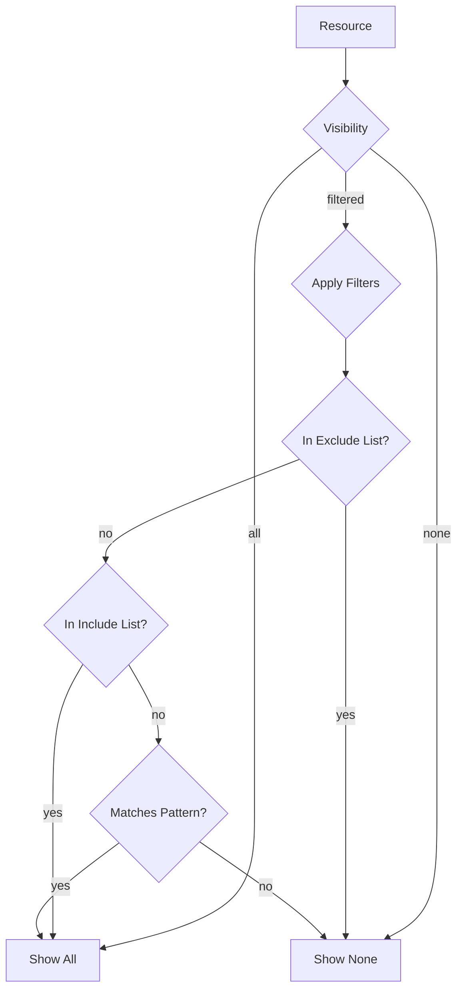
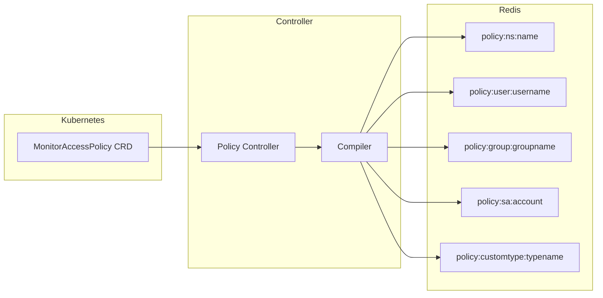

# RBAC Model

This document describes the role-based access control model used by ClusterPulse to authorize access to cluster resources.

## Overview

ClusterPulse implements a policy-based RBAC system that evaluates access requests against compiled policies stored in Redis. The model supports:

- Multiple subject types (users, groups, service accounts)
- Fine-grained resource filtering (clusters, nodes, namespaces, operators, pods)
- Custom resource types defined via MetricSource CRDs
- Priority-based policy resolution
- Time-based policy validity

## Core Components



### Principal

The entity making a request. Contains:

| Field | Type | Description |
|-------|------|-------------|
| `username` | string | Unique identifier |
| `email` | string | Optional email address |
| `groups` | list | Group memberships |
| `is_service_account` | bool | Whether this is a service account |
| `attributes` | dict | Additional metadata |

Principals are extracted from OAuth proxy headers or Kubernetes authentication.

### Resource

The object being accessed:

| Field | Type | Description |
|-------|------|-------------|
| `type` | enum | Resource type (see below) |
| `name` | string | Resource name |
| `namespace` | string | Kubernetes namespace (if applicable) |
| `cluster` | string | Cluster name |
| `labels` | dict | Resource labels |

#### Resource Types

| Type | Description |
|------|-------------|
| `CLUSTER` | A monitored Kubernetes cluster |
| `NODE` | A cluster node |
| `NAMESPACE` | A Kubernetes namespace |
| `OPERATOR` | An OLM-managed operator |
| `POD` | A pod (used for namespace-scoped filtering) |
| `ALERT` | A cluster alert |
| `EVENT` | A cluster event |
| `CUSTOM` | A custom resource defined by MetricSource |

### Action

Operations that can be performed:

| Action | Description |
|--------|-------------|
| `VIEW` | Basic read access |
| `VIEW_METRICS` | Access to performance metrics |
| `VIEW_SENSITIVE` | Access to sensitive data |
| `VIEW_COSTS` | Access to cost information |
| `VIEW_SECRETS` | Access to secret values |
| `VIEW_METADATA` | Access to filtering metadata |
| `VIEW_AUDIT` | Access to audit logs |
| `EDIT` | Modify resources |
| `DELETE` | Delete resources |
| `EXECUTE` | Execute commands |

## Policy Structure

Policies are defined as `MonitorAccessPolicy` custom resources:

```yaml
apiVersion: clusterpulse.io/v1alpha1
kind: MonitorAccessPolicy
metadata:
  name: policy-name
  namespace: clusterpulse
spec:
  identity:
    priority: 100
    subjects:
      users: []
      groups: []
      serviceAccounts: []
  
  access:
    effect: Allow | Deny
    enabled: true
  
  scope:
    clusters:
      default: all | none | filtered
      rules:
        - selector: {}
          permissions: {}
          resources: {}
  
  lifecycle:
    validity:
      notBefore: "2024-01-01T00:00:00Z"
      notAfter: "2024-12-31T23:59:59Z"
  
  operations:
    audit:
      logAccess: true
      requireReason: false
```

### Identity Section

Defines who the policy applies to and its evaluation priority.

**Priority**: Integer from 0-999. Lower values are evaluated first. When multiple policies match, the first Allow or Deny decision wins.

**Subjects**: Policies can target:

- Individual users by username or email
- Groups (resolved at request time from OpenShift)
- Service accounts by name and namespace

### Access Section

**Effect**: Determines the authorization outcome when the policy matches.

| Effect | Behavior |
|--------|----------|
| `Allow` | Grant access with specified permissions and filters |
| `Deny` | Block access regardless of other policies |

**Enabled**: Boolean flag to enable/disable the policy without deleting it.

### Scope Section

Defines which clusters and resources the policy covers.

**Default Cluster Access**:

| Value | Behavior |
|-------|----------|
| `all` | Access all clusters unless restricted by rules |
| `none` | Deny by default; only rules grant access |
| `filtered` | Apply rule-based filtering |

**Rules**: Array of cluster access rules, each containing:

- `selector`: Label-based cluster matching
- `permissions`: Actions allowed on matching clusters
- `resources`: Resource-level filters

### Resource Filters

Each resource type supports filtering:

```yaml
resources:
  nodes:
    visibility: all | none | filtered
    filters:
      hideMasters: true
      labelSelector: {}
  
  namespaces:
    visibility: filtered
    filters:
      allowed:
        - "app-*"
      denied:
        - "kube-system"
  
  operators:
    visibility: filtered
    filters:
      allowedNamespaces:
        - "operator-*"
      deniedNames:
        - "*-test"
  
  pods:
    visibility: filtered
    filters:
      allowedNamespaces:
        - "app-*"
```

### Custom Resource Filters

Custom resources defined by MetricSource CRDs can be filtered using the `custom` section:

```yaml
resources:
  custom:
    pvc:  # resourceTypeName from MetricSource
      visibility: all | none | filtered
      filters:
        namespaces:
          allowed:
            - "app-*"
          denied:
            - "kube-system"
        names:
          allowed:
            - "data-*"
          denied:
            - "*-test"
        fields:
          storageClass:
            allowed:
              - "gp3"
              - "io2"
          phase:
            denied:
              - "Failed"
      aggregations:
        include:
          - "totalStorage"
          - "countByStorageClass"
        exclude:
          - "costEstimate"
```

**Custom Resource Filter Properties**:

| Property | Description |
|----------|-------------|
| `visibility` | `all`, `none`, or `filtered` |
| `filters.namespaces` | Filter by resource namespace |
| `filters.names` | Filter by resource name |
| `filters.fields` | Filter by extracted field values |
| `aggregations.include` | Whitelist of visible aggregations |
| `aggregations.exclude` | Blacklist of hidden aggregations |

**Field Filtering**: Supports both pattern matching and operator-based conditions:

```yaml
fields:
  storageBytes:
    conditions:
      - operator: greaterThan
        value: 1073741824
      - operator: lessThan
        value: 10737418240
```

Supported operators: `equals`, `notEquals`, `contains`, `startsWith`, `endsWith`, `greaterThan`, `lessThan`, `in`, `notIn`, `matches`.

## Decision Types

The RBAC engine returns one of three decisions:

| Decision | Description |
|----------|-------------|
| `ALLOW` | Full access granted |
| `DENY` | Access blocked |
| `PARTIAL` | Access granted with filters applied |

A `PARTIAL` decision includes filters that restrict which resources are visible.

## Filter Model

Filters control resource visibility when `visibility: filtered` is set:



### Filter Properties

| Property | Type | Description |
|----------|------|-------------|
| `visibility` | enum | `all`, `none`, or `filtered` |
| `include` | set | Literal values to include |
| `exclude` | set | Literal values to exclude (takes precedence) |
| `patterns` | list | Wildcard patterns to match |
| `labels` | dict | Label selectors |

### Pattern Syntax

| Pattern | Matches |
|---------|---------|
| `*` | Any characters |
| `?` | Single character |
| `app-*` | `app-frontend`, `app-backend`, etc. |
| `team-?-prod` | `team-a-prod`, `team-b-prod`, etc. |

## Custom Resource Authorization

Custom resources follow a specialized authorization flow that integrates with the MetricSource-defined schema.

### CustomResourceFilter

Filters for custom resources support three levels:

| Level | Description |
|-------|-------------|
| Namespace | Filter by the namespace identifier field |
| Name | Filter by the resource name identifier field |
| Fields | Filter by any field in `rbac.filterableFields` |

### CustomResourceDecision

The authorization decision for custom resources includes:

| Field | Type | Description |
|-------|------|-------------|
| `decision` | enum | `ALLOW`, `DENY`, or `PARTIAL` |
| `resource_type_name` | string | The MetricSource resourceTypeName |
| `filters` | CustomResourceFilter | Applicable filters |
| `allowed_aggregations` | set | Aggregations user can see (null = all) |
| `denied_aggregations` | set | Aggregations hidden from user |
| `permissions` | set | Granted actions |

### Aggregation Filtering

When `filterAggregations: true` in the MetricSource (default), aggregations are recomputed from the filtered resource set. Policies can additionally restrict which aggregation values are visible:

- `include`: Only these aggregations are shown
- `exclude`: These aggregations are hidden
- Include takes precedence over exclude

## Storage Model

Policies are compiled and stored in Redis for fast evaluation:



### Redis Key Patterns

| Pattern | Purpose |
|---------|---------|
| `policy:{namespace}:{name}` | Compiled policy data |
| `policy:user:{user}` | Policies indexed by user |
| `policy:group:{group}` | Policies indexed by group |
| `policy:sa:{serviceaccount}` | Policies indexed by service account |
| `policy:customtype:{typename}` | Policies indexed by custom resource type |
| `policies:all` | Set of all policy keys |
| `policies:enabled` | Set of enabled policy keys |
| `policies:by:priority` | Sorted set by priority |

## Caching

The RBAC engine supports optional decision caching:

- Cache key: `{principal}:{action}:{resource}`
- Custom resource cache key: `rbac:custom:{principal}:{typename}:{cluster}:{action}`
- Configurable TTL (default: disabled for real-time evaluation)
- Automatically invalidated when policies change

Cache invalidation occurs when:

1. A policy is created, updated, or deleted
2. Policy affects users, groups, or service accounts that have cached decisions
3. Manual cache clear via API

## Related Documentation

- [Policy Evaluation](policy-evaluation.md) - Detailed evaluation algorithm
- [RBAC Basics Tutorial](../tutorials/rbac-basics.md) - Hands-on introduction
- [Create Read-Only Policy](../how-to/policies/create-readonly-policy.md) - Practical example
- [Grant Custom Resource Access](../how-to/policies/grant-custom-resource-access.md) - Custom resource RBAC guide
