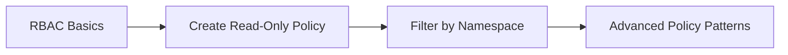

# Tutorials

This section contains step-by-step tutorials for learning ClusterPulse concepts and workflows.

## Available Tutorials

| Tutorial | Description | Duration |
|----------|-------------|----------|
| [RBAC Basics](rbac-basics.md) | Learn the fundamentals of ClusterPulse role-based access control | 20 min |

## Prerequisites

Before starting these tutorials, ensure you have:

- A running ClusterPulse installation
- `oc` access to the cluster where ClusterPulse is deployed
- At least one monitored cluster configured
- Administrative access to create `MonitorAccessPolicy` resources

## Learning Path

### Recommended Order

1. **RBAC Basics** - Understand the core concepts before creating policies
2. **Create Read-Only Policy** - Apply your knowledge with a simple policy
3. **Filter by Namespace** - Learn fine-grained access control

## Tutorial Format

Each tutorial follows a consistent structure:

- **Objectives** - What you will learn
- **Prerequisites** - What you need before starting
- **Steps** - Numbered instructions with code examples
- **Verification** - How to confirm each step succeeded
- **Summary** - Key takeaways

## Getting Help

If you encounter issues while following these tutorials:

1. Check the troubleshooting section at the end of each tutorial
2. Review the policy controller logs: `oc logs -n clusterpulse deployment/policy-controller`
3. Verify your policy syntax against the [RBAC Model](../concepts/rbac-model.md) reference
