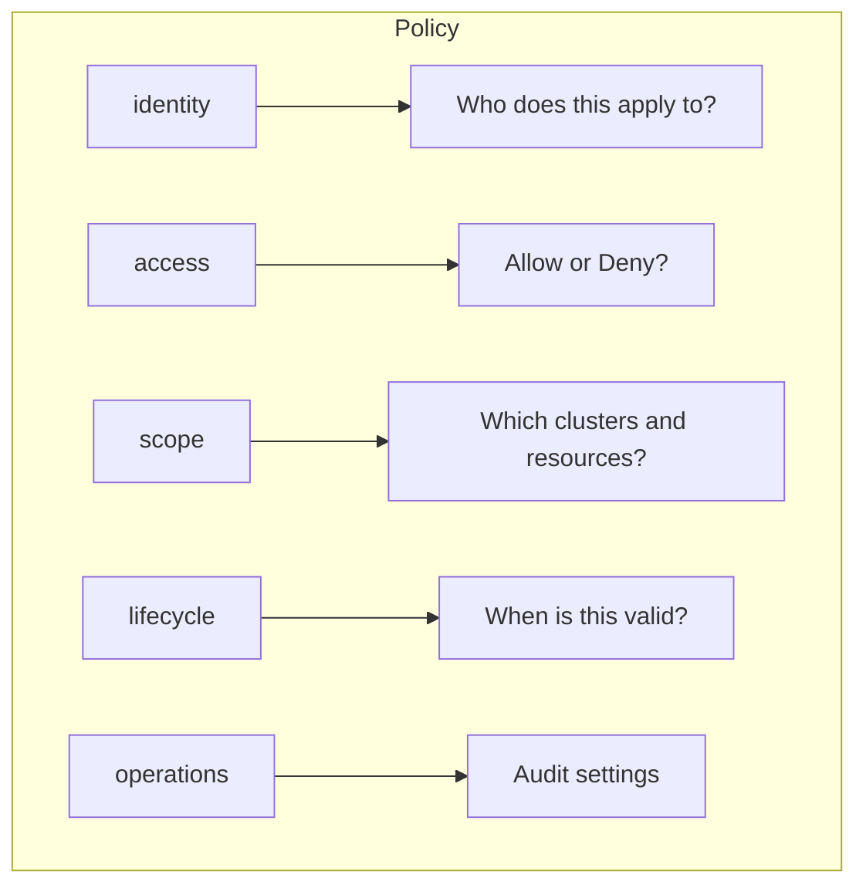

# RBAC Basics Tutorial

This tutorial introduces the fundamentals of ClusterPulse role-based access control (RBAC). You will learn how policies work, create your first policy, and verify it takes effect.

## Objectives

By the end of this tutorial, you will:

- Understand the ClusterPulse RBAC model
- Create a basic `MonitorAccessPolicy`
- Verify policy application through the API
- Debug common policy issues

## Prerequisites

- ClusterPulse deployed and accessible
- `kubectl` configured with cluster access
- At least one cluster being monitored by ClusterPulse
- A test user or group to apply policies to

## Step 1: Understand the Policy Structure

A `MonitorAccessPolicy` consists of five sections:



| Section | Purpose |
|---------|---------|
| `identity` | Defines subjects (users, groups, service accounts) and priority |
| `access` | Sets the effect (Allow/Deny) and enabled state |
| `scope` | Specifies cluster rules, permissions, and resource filters |
| `lifecycle` | Optional validity period (notBefore, notAfter) |
| `operations` | Optional audit configuration |

## Step 2: View Current Policies

Check existing policies in your cluster:

```bash
kubectl get monitoraccesspolicies -n clusterpulse
```

Expected output:

```
NAME                  STATE    AGE
default-admin         Active   5d
example-readonly      Active   2d
```

View details of a policy:

```bash
kubectl get monitoraccesspolicy default-admin -n clusterpulse -o yaml
```

## Step 3: Create Your First Policy

Create a file named `tutorial-policy.yaml`:

```yaml
apiVersion: clusterpulse.io/v1alpha1
kind: MonitorAccessPolicy
metadata:
  name: tutorial-viewers
  namespace: clusterpulse
spec:
  identity:
    priority: 200
    subjects:
      groups:
        - tutorial-group
  
  access:
    effect: Allow
    enabled: true
  
  scope:
    clusters:
      default: all
      rules:
        - selector: {}
          permissions:
            view: true
            viewMetrics: true
```

Apply the policy:

```bash
kubectl apply -f tutorial-policy.yaml
```

## Step 4: Verify Policy Compilation

The policy controller compiles policies into optimized structures stored in Redis. Check the status:

```bash
kubectl get monitoraccesspolicy tutorial-viewers -n clusterpulse -o jsonpath='{.status}'
```

Expected output:

```json
{
  "state": "Active",
  "message": "Policy is active",
  "compiledAt": "2024-01-15T10:30:00Z",
  "affectedGroups": 1,
  "hash": "a1b2c3d4e5f6"
}
```

If the state is `Error`, check the policy controller logs:

```bash
kubectl logs -n clusterpulse deployment/policy-controller | grep tutorial-viewers
```

## Step 5: Test Policy via API

### Check Authentication Status

```bash
curl -s https://clusterpulse.example.com/api/v1/auth/status | jq
```

### View Applied Policies

```bash
curl -s https://clusterpulse.example.com/api/v1/auth/policies | jq
```

This returns all policies that apply to the current user:

```json
{
  "user": {
    "username": "testuser",
    "groups": ["tutorial-group"]
  },
  "total_policies": 1,
  "policies": [
    {
      "source": "group:tutorial-group",
      "policy": {
        "policy_name": "tutorial-viewers",
        "effect": "Allow",
        "enabled": true
      },
      "priority": 200
    }
  ]
}
```

### View Effective Permissions

```bash
curl -s https://clusterpulse.example.com/api/v1/auth/permissions | jq
```

## Step 6: Modify the Policy

Update the policy to restrict access to specific clusters. Edit `tutorial-policy.yaml`:

```yaml
apiVersion: clusterpulse.io/v1alpha1
kind: MonitorAccessPolicy
metadata:
  name: tutorial-viewers
  namespace: clusterpulse
spec:
  identity:
    priority: 200
    subjects:
      groups:
        - tutorial-group
  
  access:
    effect: Allow
    enabled: true
  
  scope:
    clusters:
      default: none  # Changed from 'all'
      rules:
        - selector:
            environment: development
          permissions:
            view: true
            viewMetrics: true
```

Apply the updated policy:

```bash
kubectl apply -f tutorial-policy.yaml
```

The change takes effect immediately. Users in `tutorial-group` now only see clusters with the label `environment: development`.

## Step 7: Add Resource Filtering

Further restrict the policy to specific namespaces:

```yaml
apiVersion: clusterpulse.io/v1alpha1
kind: MonitorAccessPolicy
metadata:
  name: tutorial-viewers
  namespace: clusterpulse
spec:
  identity:
    priority: 200
    subjects:
      groups:
        - tutorial-group
  
  access:
    effect: Allow
    enabled: true
  
  scope:
    clusters:
      default: none
      rules:
        - selector:
            environment: development
          permissions:
            view: true
            viewMetrics: true
          resources:
            namespaces:
              visibility: filtered
              filters:
                allowed:
                  - "tutorial-*"
                  - default
```

Apply and verify:

```bash
kubectl apply -f tutorial-policy.yaml

# Check the namespace list for a development cluster
curl -s https://clusterpulse.example.com/api/v1/clusters/dev-cluster/namespaces | jq
```

Only namespaces matching `tutorial-*` or `default` should be returned.

## Step 8: Clean Up

Remove the tutorial policy:

```bash
kubectl delete monitoraccesspolicy tutorial-viewers -n clusterpulse
```

## Key Concepts Summary

### Policy Priority

- Lower numbers = higher priority
- Range: 0-999
- First matching Allow or Deny wins

### Effect Types

| Effect | Behavior |
|--------|----------|
| `Allow` | Permits access if policy matches |
| `Deny` | Blocks access if policy matches |

### Visibility Levels

| Level | Description |
|-------|-------------|
| `all` | No restrictions |
| `none` | Complete restriction |
| `filtered` | Apply filter rules |

### Subject Types

| Type | Example |
|------|---------|
| Users | `alice@example.com` |
| Groups | `platform-team` |
| Service Accounts | `name: monitoring-sa, namespace: monitoring` |

## Troubleshooting

### Policy Not Taking Effect

1. Verify the policy state is `Active`
2. Confirm the user's groups match the policy subjects
3. Check for higher-priority policies that might override

### Access Unexpectedly Denied

1. Look for `Deny` policies with higher priority
2. Verify the cluster labels match the selector
3. Check if resource filters are too restrictive

### Policy Stuck in Error State

1. Review the policy controller logs
2. Validate YAML syntax
3. Check for invalid field values (e.g., negative priority)

## Next Steps

- [Create Read-Only Policy](../how-to/policies/create-readonly-policy.md) - Detailed guide on read-only access
- [Filter by Namespace](../how-to/policies/filter-by-namespace.md) - Advanced namespace filtering
- [Policy Evaluation](../concepts/policy-evaluation.md) - Understand the evaluation algorithm
